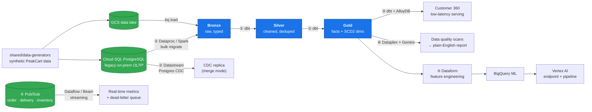
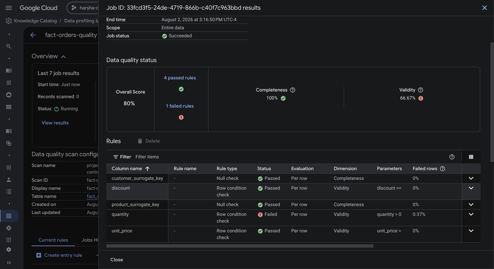
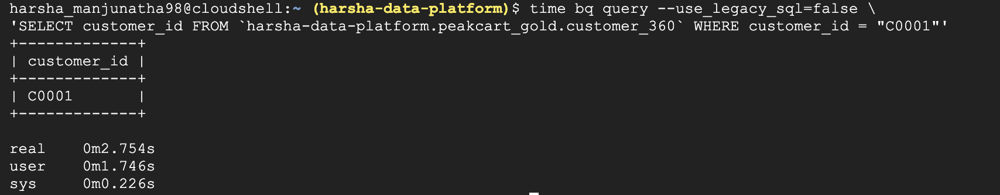
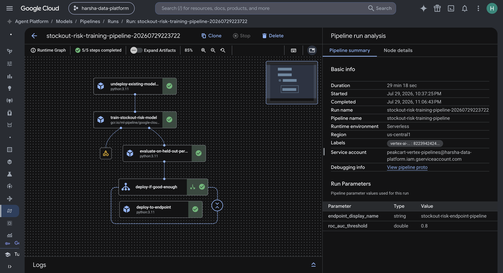

# PeakCart GCP Data Platform

[](https://github.com/HarshaM98/peakcart-gcp-data-platform/actions/workflows/dbt-ci.yml)
[](https://github.com/HarshaM98/peakcart-gcp-data-platform/actions/workflows/project04-ci.yml)
[](https://github.com/HarshaM98/peakcart-gcp-data-platform/actions/workflows/project05-ci.yml)
[](LICENSE)
[](https://www.terraform.io/)
[](https://cloud.google.com/)

Six independent, production-shaped data engineering projects on Google Cloud,
built around **PeakCart** — a fictional grocery delivery company. Batch
warehousing, a legacy database migration, a real-time streaming pipeline, an
ML serving pipeline, and an AI-assisted data governance layer.

Every project was **verified against real GCP infrastructure**, not just
written. Every project was then **torn down** — the repository documents both
the build and the teardown.

> **All data is synthetic.** The generators in `shared/data-generators/` use a
> fixed `SEED = 42` and deliberately inject data-quality defects (NULL emails,
> negative quantities, duplicate orders) so the quality checks have something
> real to catch. No real customer or business data appears anywhere.

---

## Architecture



Orchestration is **Cloud Composer (Airflow)** in projects 3, 4 and 6; all
infrastructure is **Terraform** with remote state, except where noted below.

---

## The six projects

| # | Project | What it demonstrates | Headline result |
|---|---|---|---|
| 1 | **[Data Warehouse](project-01-data-warehouse/)** | Medallion architecture, dbt Core, SCD Type 2 (snapshots *and* effective-dated), incremental facts with a late-arrival lookback | 21 models, 1 snapshot, **156 data tests** |
| 2 | **[Cloud Migration](project-02-cloud-migration/)** | Live PostgreSQL → BigQuery via Dataproc/Spark JDBC, plus **Datastream CDC** for ongoing sync, orchestrated with an ephemeral-cluster DAG | 7 tables migrated; insert/update/**delete** all captured correctly |
| 3 | **[Customer 360](project-03-customer-360/)** | Sessionization with window functions, a 3-layer dbt design, **AlloyDB** as a separate low-latency serving path | Point lookups **~2.5 ms** vs ~3.5 s in BigQuery |
| 4 | **[Real-time Ops](project-04-realtime-ops/)** | Apache Beam streaming, dead-letter queues, dedup, late-data handling, session windows — built as 10 incremental steps | 4 live metrics on real Dataflow; **24 unit tests** |
| 5 | **[Supply Chain ML](project-05-supply-chain-ml/)** | Dataform, BigQuery ML, Vertex AI Model Registry + endpoint, and a KFP pipeline with a conditional deploy gate | **ROC AUC 0.90**; auto-deploy only above threshold |
| 6 | **[Governance + AI](project-06-governance-ai/)** | Dataplex data quality scans feeding the **Gemini API** to generate a governance report | Caught 3 real, previously-invisible data defects |

Each project folder has its own README with architecture, key technical
decisions, verification results, and embedded evidence. Projects 2 and 4 also
have a `COMMANDS.md`; projects 2, 4, 5 and 6 keep a dated `NOTES.md` build log.

---

## Selected evidence

**Project 6 — Dataplex caught a real defect that the dbt pipeline silently dropped.**
`stg_order_items` computes an `is_positive_quantity` flag, but `fact_orders`
never carries it forward or filters on it, so 55 invalid rows reach the gold
layer unflagged:

 0 rule failing on 0.37% of fact_orders rows" />

**Project 3 — AlloyDB vs BigQuery for point lookups**, measured rather than assumed:



**Project 5 — the Vertex AI pipeline** (undeploy → train → evaluate → conditional deploy):



---

## What I actually learned

The `NOTES.md` files are the most useful thing here. They record real failures
and the reasoning that resolved them, not just the happy path:

- **A silent caching bug that made an entire ML pipeline a no-op.** Vertex AI
  Pipelines cache task executions by input hash *regardless of side effects*.
  With fixed parameters, a scheduled retrain re-ran nothing — the "deploy" step
  returned a byte-identical endpoint reference. Only visible by diffing output
  artifacts, not from task status.
  → [project-05 NOTES](project-05-supply-chain-ml/NOTES.md)
- **A hidden service account no documentation mentions.** `BigqueryCreateModelJobOp`
  doesn't run as the pipeline's configured service account — it runs as a
  Vertex-managed tenant-project SA. Found by tracing
  `authenticationInfo.principalEmail` in audit logs after two identical-looking
  IAM failures. → [project-05 NOTES](project-05-supply-chain-ml/NOTES.md)
- **Why a naive `SUM()` over streaming output was ~10× wrong.** Under Beam's
  `ACCUMULATING` mode, each late-data refire re-emits a window's cumulative
  value. Any rollup must dedupe to the latest row per window first.
  → [project-04 NOTES](project-04-realtime-ops/NOTES.md)
- **An org policy that shaped two different fixes.** External IPs were blocked
  on VMs, so the Cloud SQL Auth Proxy couldn't reach Cloud SQL *from a Dataproc
  node* — fixed with private IP. Datastream then hit VPC peering's
  non-transitive routing limit — fixed with IP allowlisting instead.
  → [project-02 NOTES](project-02-cloud-migration/NOTES.md)
- **A platform limitation documented rather than glossed over.** Vertex AI
  Model Monitoring's periodic scheduler never fired despite correct config and
  confirmed serving-log ingestion. Recorded as an open platform gap after
  verifying the other three components worked.
  → [project-05 NOTES](project-05-supply-chain-ml/NOTES.md)

---

## Tech stack

| Layer | Tools |
|---|---|
| **Warehouse / lake** | BigQuery, Cloud Storage, AlloyDB, Cloud SQL (PostgreSQL) |
| **Transformation** | dbt Core 1.8.7, Dataform |
| **Batch / migration** | Dataproc (PySpark), Datastream (CDC) |
| **Streaming** | Pub/Sub, Dataflow (Apache Beam) |
| **ML / AI** | BigQuery ML, Vertex AI (Registry, Endpoints, Pipelines/KFP), Gemini API |
| **Governance** | Dataplex, IAM, Secret Manager |
| **Orchestration** | Cloud Composer (Airflow 2) |
| **IaC / CI** | Terraform (GCS remote state), GitHub Actions |
| **Languages** | Python 3.11, SQL |

---

## Repository structure

```
peakcart-gcp-data-platform/
├── project-01-data-warehouse/     # BigQuery + dbt medallion warehouse
├── project-02-cloud-migration/    # Dataproc bulk migration + Datastream CDC
├── project-03-customer-360/       # dbt intermediate layer + AlloyDB serving
├── project-04-realtime-ops/       # Pub/Sub + Beam streaming pipeline
├── project-05-supply-chain-ml/    # Dataform + BQML + Vertex AI
├── project-06-governance-ai/      # Dataplex DQ + Gemini reporting
├── shared/data-generators/        # Deterministic synthetic data (SEED = 42)
└── .github/workflows/             # CI: dbt build, Beam tests, Terraform validate
```

Each project follows the same layout: `infrastructure/terraform/`, code,
`screenshots/`, `README.md`, and (where applicable) `NOTES.md` + `COMMANDS.md`.

---

## Getting started

```bash
git clone https://github.com/HarshaM98/peakcart-gcp-data-platform.git
cd peakcart-gcp-data-platform

# Generate the synthetic dataset (deterministic, no GCP needed)
python3.11 shared/data-generators/generate_peakcart_data.py
python3.11 shared/data-generators/generate_project03_data.py
python3.11 shared/data-generators/generate_project05_data.py

# Run the Beam unit tests -- no GCP account required
cd project-04-realtime-ops
python3.11 -m unittest discover -s pipeline -p "test_*.py" -v
```

For anything touching GCP, start with the individual project README. Each has a
**How to Run** section, and projects 2 and 4 have a `COMMANDS.md` with the
exact commands used.

**Prerequisites for the cloud portions:** a GCP project with billing enabled,
plus `gcloud`, `terraform` ≥ 1.9, and Python 3.11.

---

## Cost discipline

Every billable resource in this repository was created, verified with real
evidence, and then **deleted** — Dataflow jobs, Dataproc clusters, Cloud SQL
instances, Datastream streams, Vertex AI endpoints, and Composer environments
(the most expensive item here by a wide margin).

**Nothing is currently running.** What remains provisioned is only free or
near-free: BigQuery datasets, service accounts, IAM bindings, Pub/Sub topics,
and staging buckets with short lifecycle rules. Each project's README documents
its own teardown, and `NOTES.md` records what was deleted and how it was
confirmed gone.

---

## Known gaps

Stated plainly, because a portfolio that hides its own weaknesses is less
useful than one that names them:

- **Portability.** Project IDs, bucket names, a service account email, and one
  private IP are hardcoded to my GCP project. Running this against your own
  project requires substitution. Bucket names are globally unique, so the five
  `backend "gcs"` blocks need editing too.
- **IaC coverage.** Project 3 has no Terraform — AlloyDB, Composer and Looker
  Studio were set up manually. Parts of project 5 (Dataform repo, Vertex
  endpoint, schedules) are also CLI-provisioned rather than declared.
- **Test coverage.** Only project 4 has Python unit tests (24 of them).
  Projects 1 and 3 have dbt data tests, which are not the same thing.
- **No observability.** There are no alert policies or log sinks. For a
  repository that calls itself a platform, that's the largest structural gap.
- **Code duplication.** Project 4's `step1`–`step10` files are a deliberate
  teaching progression, so `ParseAndValidate` exists in seven near-identical
  copies. The deployed artifact (`step10`) inherits that duplication.
- **No linting or type checking.** No ruff/black/mypy configuration yet.

---

## License

[MIT](LICENSE) — free to use, learn from, and adapt.
