# Project 2: Cloud Migration Simulator

## Overview

Demonstrates migrating PeakCart's legacy on-prem PostgreSQL OLTP database
to GCP: a real Cloud SQL PostgreSQL instance (standing in for the "legacy
on-prem" source) is bulk-migrated to BigQuery via Dataproc/Spark, kept in
sync going forward via Datastream's real Postgres CDC (logical
replication), and the whole bulk-migration path is orchestrated by an
ephemeral-cluster Cloud Composer DAG. The legacy data reuses the same
customers/products/suppliers/orders/order_items/inventory_snapshots/
product_price_history CSVs already used by projects 1 and 3 -- this is
the same company's data, just told as "how did it get into GCP in the
first place."

This is the only project in the portfolio with a real live-database
source rather than static CSVs, and the only one using Dataproc,
Datastream, and (a third use of) Cloud Composer.

## Architecture

```
Cloud SQL PostgreSQL (legacy on-prem OLTP, db-f1-micro)
  |
  |-- Phase 2: Dataproc/Spark bulk migration (JDBC read, one-time/periodic)
  |     -> BigQuery peakcart_migration_bronze.<table>  (7 tables, full history)
  |     -> orchestrated by an ephemeral-cluster Composer DAG (Phase 4):
  |          create_dataproc_cluster -> submit_bulk_migration_job
  |          -> delete_dataproc_cluster -> validate_migration_counts
  |
  |-- Phase 3: Datastream (Postgres logical replication CDC, always-on)
  |     -> BigQuery peakcart_migration_cdc.public_<table>  (current-state
  |          merge replica of changes captured going forward only --
  |          backfill_none, since Dataproc already handled history)
  |
  Both destinations are deliberately separate datasets: Datastream
  manages its own replica-table schema/merge logic, which would conflict
  with the plain overwrite-written bronze tables from Dataproc.
```

## Key Technical Decisions

### Real Cloud SQL, not simulated CSVs

Every other project's "source" is a static CSV. Project-02 is themed
around migrating a *live database* -- simulating that with CSVs would
skip the actual skill (JDBC reads, replication setup, connectivity) this
project exists to demonstrate. Stood up a real (smallest-tier) Cloud SQL
instance, same create/verify/teardown discipline as everything else in
this portfolio, with Cloud SQL's different (hourly, not on-demand)
billing model made explicit before creating it.

### Intentional duplicate rows in `orders`, not a bug

Loading `orders.csv` into Postgres hit `UniqueViolation: duplicate key
... order_id`. Checked the actual generator source before assuming
anything: `generate_peakcart_data.py` has a deliberate
`intentional_duplicate(rows, dupe_rate=0.01)` applied specifically to
orders (50 of 5050 rows), by design -- the same family as the documented
NULL-email/negative-quantity seeded issues, just not called out by name
in the top-level CLAUDE.md summary. This exists so dbt's staging dedup
pattern (project-01) has something real to demonstrate. Loaded via a
**stage-then-merge** pattern instead: land the raw CSV in an
unconstrained staging table, then `INSERT ... SELECT DISTINCT ON (pk)`
into the constrained final table -- a real legacy OLTP source wouldn't
have duplicate primary keys, so this dedup step represents what an
actual live database would already enforce.

### Dataproc cluster, not Serverless (for this build)

Considered Dataproc Serverless (no cluster lifecycle to manage), but it
needs its own VPC/Private-Google-Access setup with no simpler payoff here.
Went with a traditional Dataproc **cluster** instead -- more representative
of the hands-on Dataproc experience most real-world Data Engineer roles
still involve, and Serverless remains a reasonable alternative worth
knowing about (no cluster spin-up/teardown lifecycle, pay only for actual
job runtime) if this were optimized purely for cost/simplicity rather
than breadth of learning.

### The org policy blocking external IPs shaped two different fixes

Discovered indirectly: `apt-get install` on the Dataproc node failed
reaching the general internet ("Network is unreachable"), and separately
the Cloud SQL Auth Proxy running on that same node couldn't dial Cloud
SQL's public IP either. Both point to the same cause -- an org policy
blocking external IPs on VMs in this project, silently enforced
(`internal_ip_only` showed `true` on the real cluster regardless of what
Terraform requested, confirmed via `terraform plan` drift detection).
This shaped two different fixes:

- **Dataproc -> Cloud SQL**: gave Cloud SQL a private IP (Private Service
  Access) on the same VPC and connected Spark's JDBC read directly to it
  -- no proxy needed for VPC-internal traffic at all.
- **Datastream -> Cloud SQL**: Datastream isn't a VM in this project (it's
  an external Google-managed service), so it's *not* subject to this
  policy. Private connectivity (VPC peering) for Datastream hit a
  different, unresolved problem (transitive routing -- see below);
  switched to IP-allowlist connectivity using Cloud SQL's already-existing
  public IP instead.

### VPC peering is non-transitive -- confirmed, then worked around

Datastream's private-connectivity attempt (its own VPC peering into
`default`, alongside Cloud SQL's separate Private Service Access peering)
timed out validating connectivity, even after enabling custom route
export/import on both peerings and waiting for propagation. Two peered
networks can't reach each other *through* a shared hub VPC by default --
exactly the "transitive peering" limitation GCP peering doesn't support
without very specific configuration. Rather than keep debugging an
increasingly deep networking problem, pivoted to the simpler IP-allowlist
path (Datastream's published static IPs added as Cloud SQL authorized
networks) -- validated immediately.

### Real Postgres replication permission model, not just "grant superuser"

Cloud SQL's `postgres` admin user is a managed role (`cloudsqlsuperuser`
membership), not a true Postgres superuser -- it doesn't have the
REPLICATION login attribute by default (`ALTER ROLE postgres WITH
REPLICATION;` required), and its elevated membership doesn't bypass
standard table ACLs either (needed an explicit `GRANT SELECT ... TO
postgres` on tables owned by `peakcart_app`, the loader script's user).
Two distinct, real permission gaps, not one.

### Ephemeral Dataproc cluster lifecycle in the DAG, not a persistent cluster

The Composer DAG (`dags/project02_migration_dag.py`) creates and deletes
the Dataproc cluster per run (`DataprocCreateClusterOperator` ->
`DataprocSubmitJobOperator` -> `DataprocDeleteClusterOperator`) rather
than reusing the persistent cluster from Phase 2's interactive
development -- the standard real-world pattern, since a cluster that only
exists for one job's duration costs nothing the rest of the time.

### Cost discipline

Cloud SQL, the Dataproc clusters (both the Phase 2 persistent one and the
DAG's ephemeral one), the Datastream stream, and the Composer environment
were all created, verified live with real evidence, then torn down.
Kept (free, no ongoing cost, the actual reusable deliverable): both
BigQuery datasets, service accounts, the Secret Manager secret, and the
staging bucket with its uploaded scripts/DAG -- the whole pipeline is
redeployable from Terraform plus a `gcloud dataproc jobs submit`/DAG
trigger on demand.

## Verification Results

| Check | Result |
| --- | --- |
| Legacy data load (Postgres) | All 7 tables loaded via stage-then-merge; `orders` deduped 5050 -> 5000 rows exactly as expected |
| Dataproc bulk migration (manual run) | All 7 tables migrated via JDBC -> BigQuery; row counts and actual row values (not just counts) confirmed matching source exactly |
| Datastream CDC | Stream reached `RUNNING` with no errors; simulated insert/update/delete against `orders` all captured correctly -- new row present, updated row's status changed in place, deleted row absent from the merge-mode replica table |
| Composer DAG (live run) | All 4 tasks (`create_dataproc_cluster`, `submit_bulk_migration_job`, `delete_dataproc_cluster`, `validate_migration_counts`) succeeded; validation SQL independently re-run via `bq query`, confirmed `all_counts_match: true` across all 7 tables |
| Cost discipline | Cloud SQL, both Dataproc clusters, the Datastream stream, and the Composer environment all created, verified, then torn down; confirmed zero instances/clusters/streams/environments remaining afterward |

See `NOTES.md` for the full dated build log, including three distinct
real problems solved in Phase 3 (VPC peering transitivity, Postgres
replication permissions, table ownership ACLs) and the BigQuery
multi-region-vs-specific-region gotcha in Phase 4.

### Evidence

The legacy Cloud SQL PostgreSQL instance:

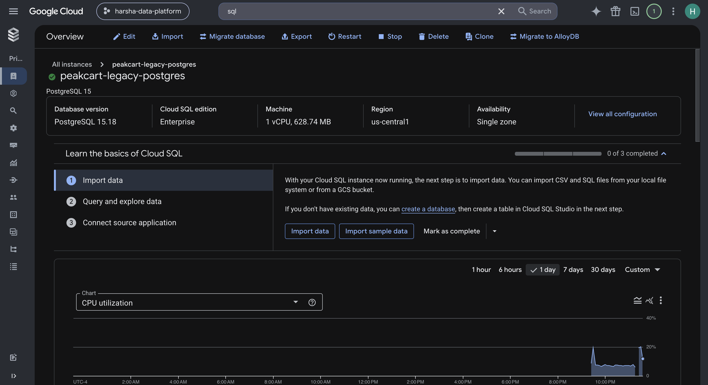
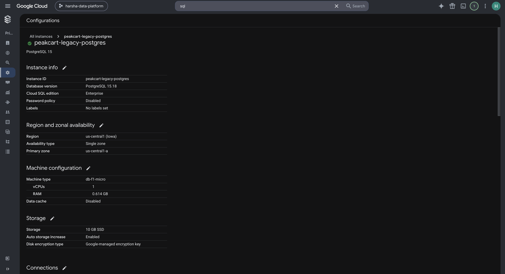

Dataproc jobs list -- the real troubleshooting story (failures during the
SSL-negotiation and internet-egress debugging, then success once fixed):

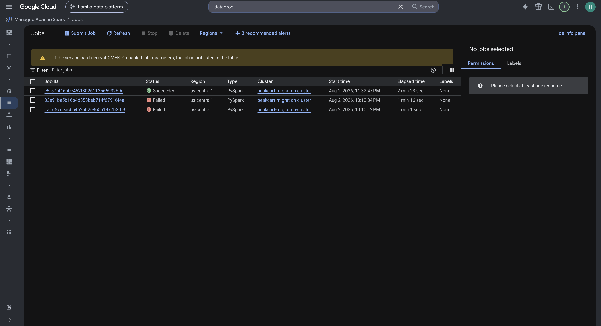

The successful bulk migration job's output, all 7 tables migrated:

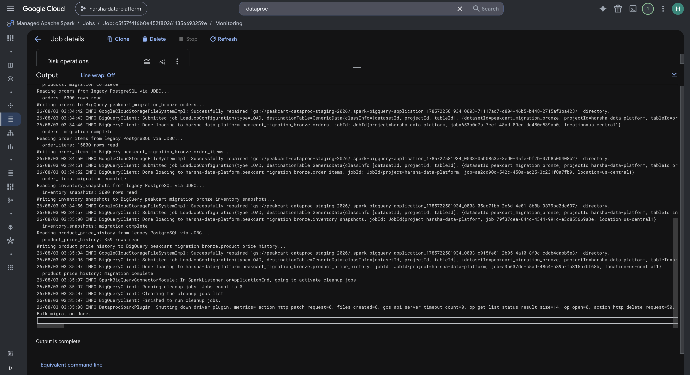
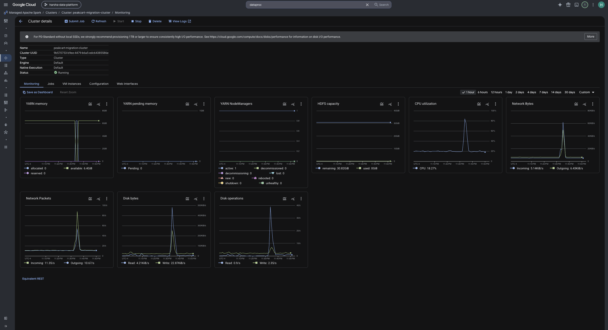

The migrated data in BigQuery:

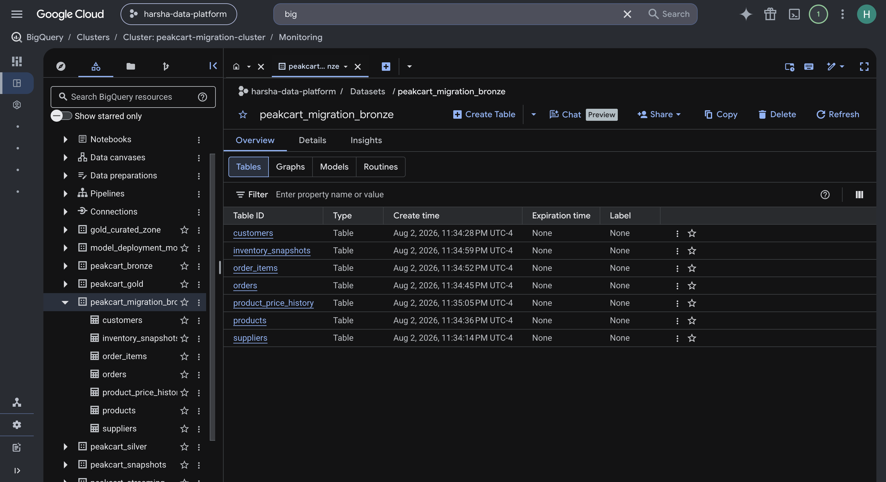
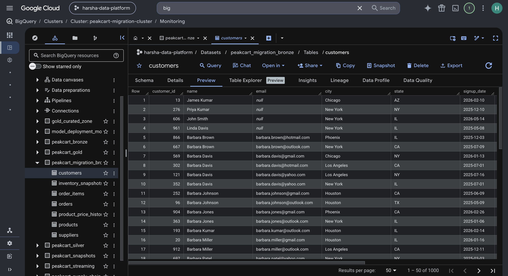

The DB password in Secret Manager (fetched at runtime by the Dataproc
job, never passed as a plaintext argument):

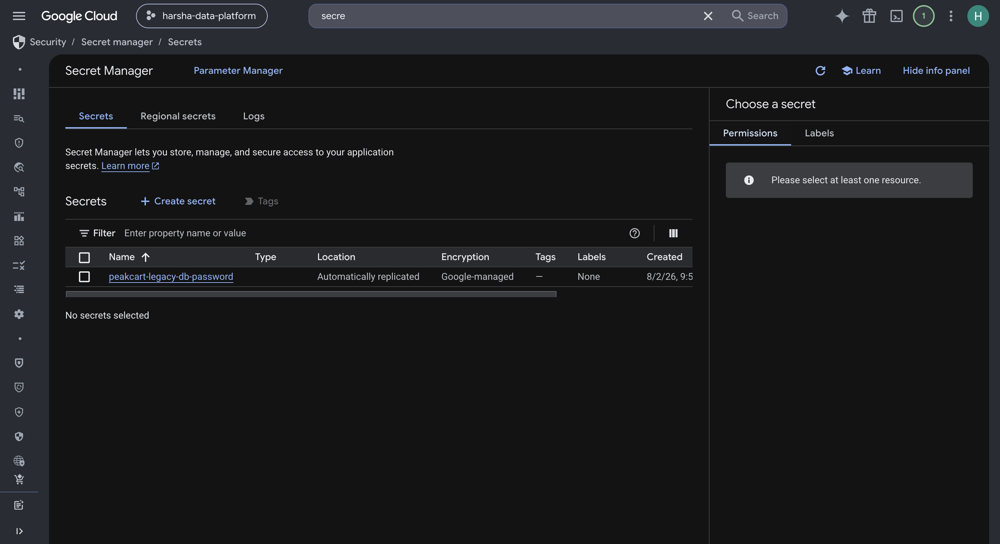

The VPC peering enabling Cloud SQL's private IP (reused by Dataproc):

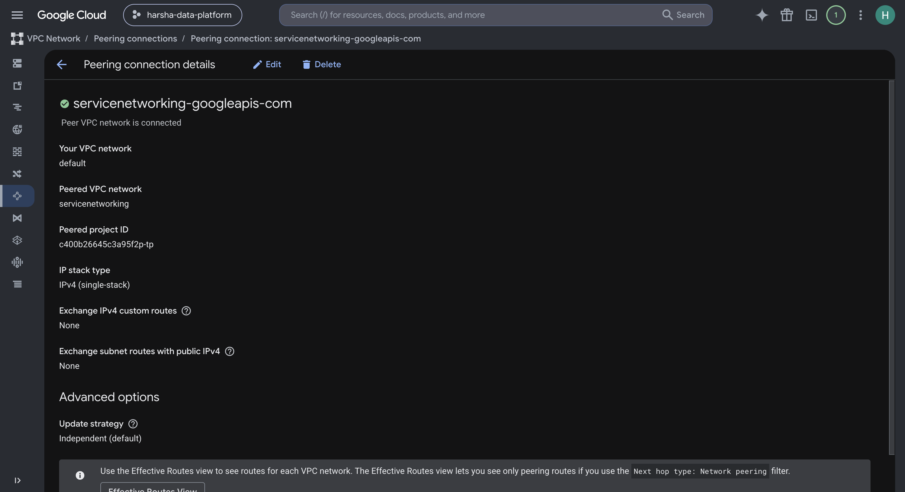

The Datastream stream, running with no errors, and its connection
profiles:

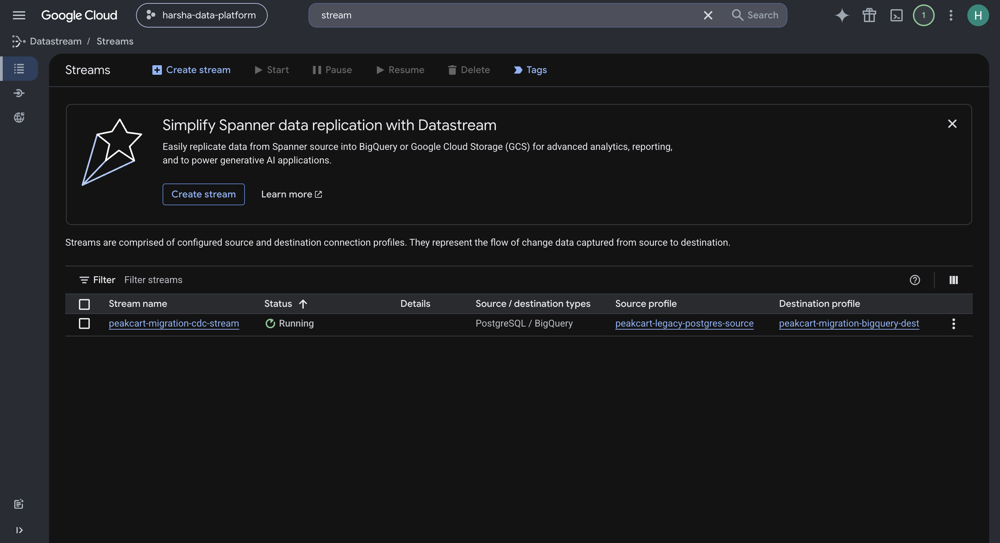
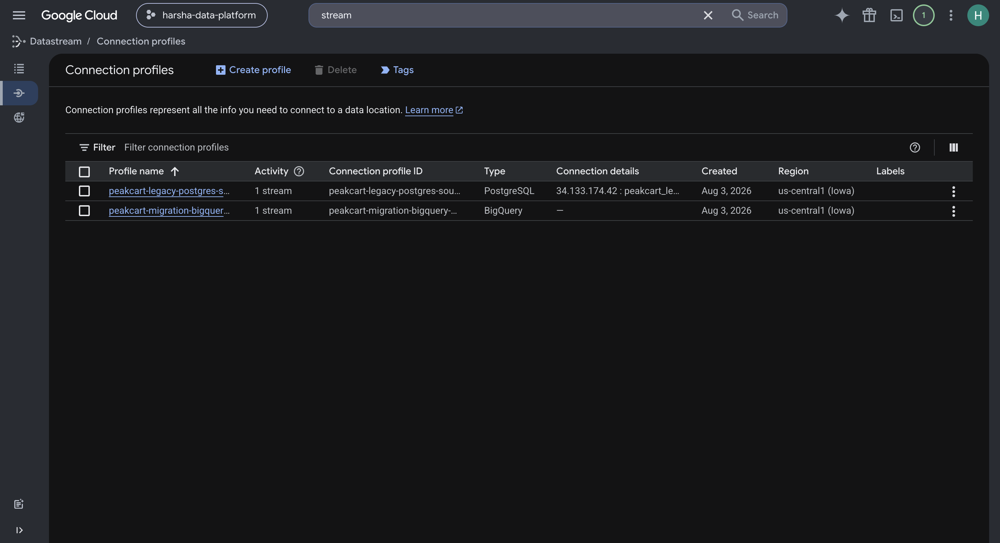

Cloud SQL's authorized networks -- Datastream's published static IPs,
the fix after private connectivity hit the transitive-routing limit:

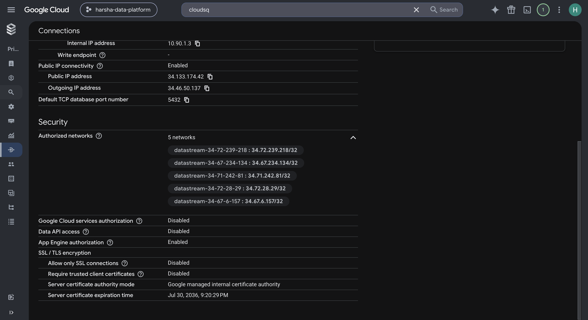

The CDC replica table -- the real proof of correct insert/update/delete
capture (order 900001 present from the insert, order 1 shows the updated
status, order 2 is absent because it was deleted):

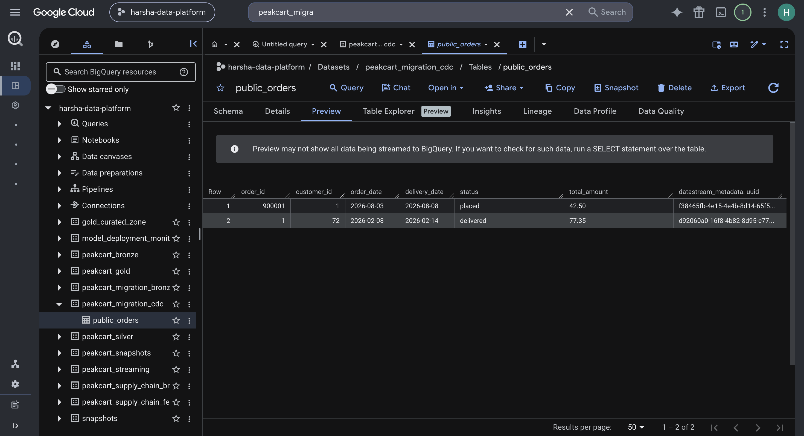

The Composer environment and the migration DAG, all 4 tasks green:

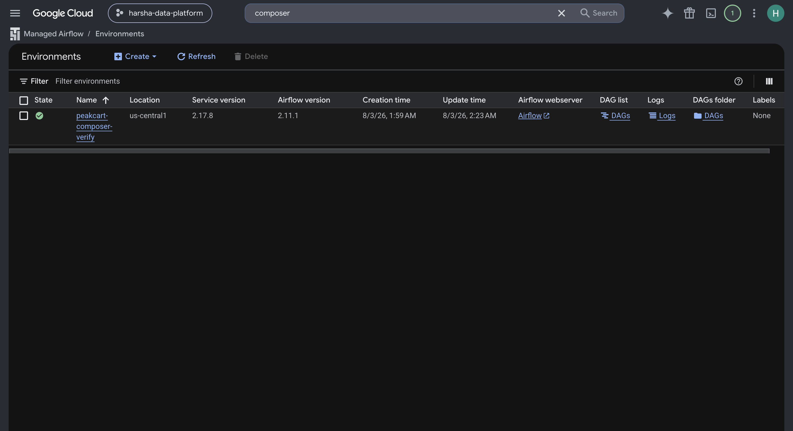
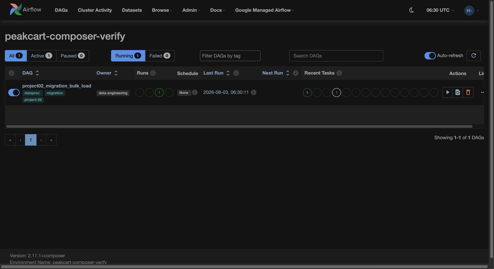
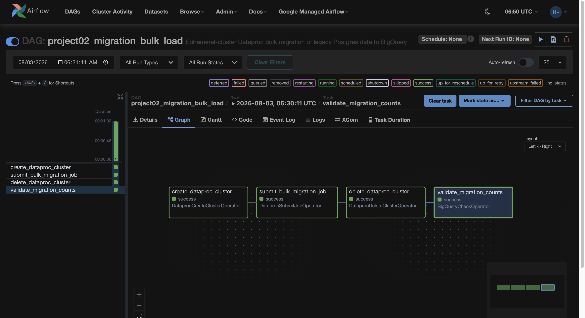
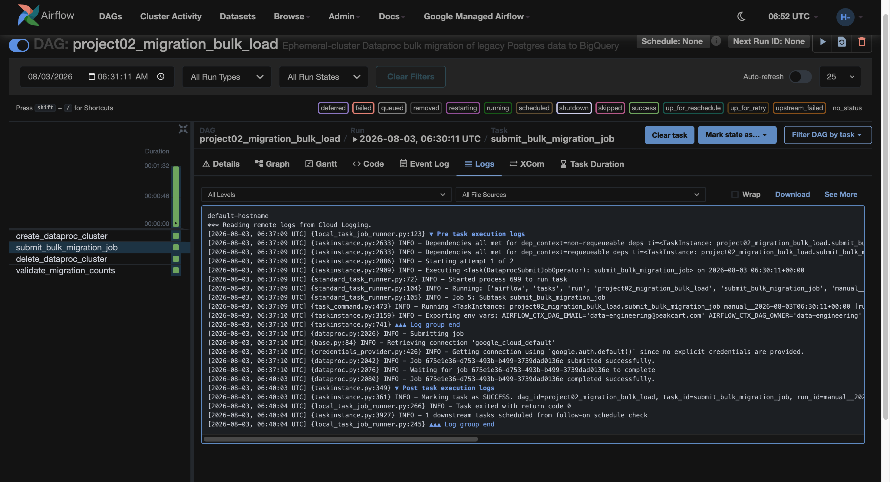

## How to Run

See `COMMANDS.md` for the complete, copy-pasteable command reference.
High-level flow:

```bash
cd project-02-cloud-migration/infrastructure/terraform
terraform init
terraform apply    # Cloud SQL, Dataproc SA/staging bucket, BigQuery
                    # datasets, Secret Manager, Datastream infra

# Load the legacy data into Cloud SQL (via the Cloud SQL Auth Proxy)
python3 scripts/load_legacy_data.py

# Run the bulk migration manually...
gcloud dataproc jobs submit pyspark scripts/bulk_migrate.py ...

# ...or via the Composer DAG (ephemeral cluster lifecycle)
gcloud composer environments run <env> dags trigger -- project02_migration_bulk_load

# Set up Datastream's logical replication prerequisites, then verify
# the stream and simulate incremental changes
python3 scripts/simulate_incremental_writes.py
```

## Files

```
project-02-cloud-migration/
  infrastructure/terraform/
    main.tf                          # Cloud SQL, Dataproc, Datastream, BigQuery, Secret Manager, IAM
    variables.tf
    outputs.tf
  scripts/
    load_legacy_data.py              # Stage-then-merge load of the shared CSVs into Cloud SQL
    bulk_migrate.py                  # PySpark: JDBC read -> BigQuery write
    install-cloud-sql-proxy.sh       # Dataproc init action (unused by the final private-IP path, kept for reference)
    setup_logical_replication.sql    # Publication + replication slot setup
    simulate_incremental_writes.py   # Insert/update/delete against Postgres for CDC verification
  dags/
    project02_migration_dag.py       # Ephemeral-cluster Composer DAG
  screenshots/                       # Evidence referenced above
  NOTES.md                           # Dated build log
  COMMANDS.md                        # Full command reference
  README.md
```
