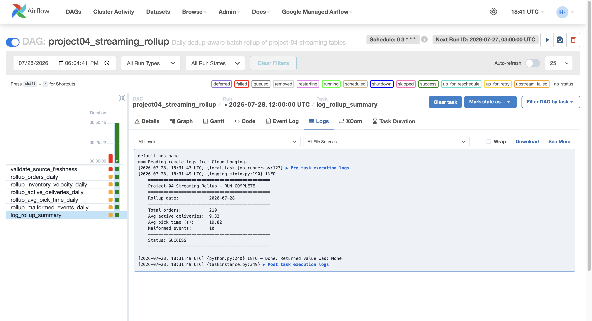
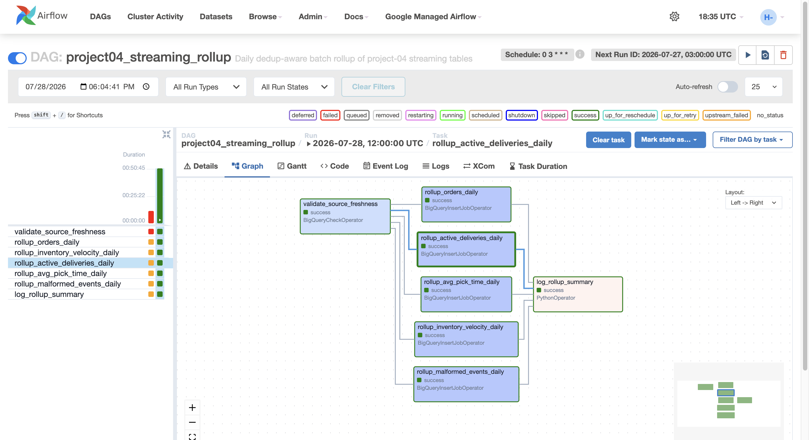
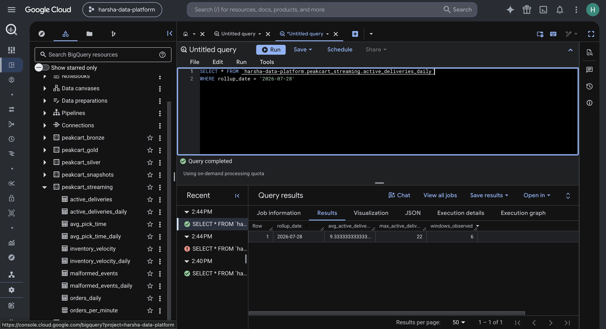
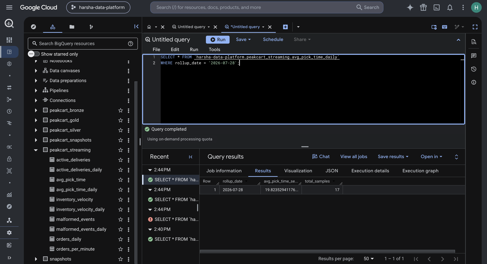

# Project 4: Real-time Operational Intelligence

## Overview

A streaming pipeline that simulates PeakCart's order, delivery, and
inventory events, publishes them to Pub/Sub, and processes them with
Apache Beam to produce four live operational metrics in BigQuery: order
throughput, inventory velocity, active deliveries, and average pick time.
Built with Pub/Sub, Apache Beam (Dataflow), BigQuery, Terraform, and
Cloud Composer.

## Architecture

```
event_simulator.py (order/delivery/inventory events, deliberately messy)
  |
  v
Pub/Sub topics, each with a dead-letter queue subscription
  |
  v
Apache Beam pipeline (DirectRunner locally, DataflowRunner in GCP)
  |
  |---> orders_per_minute       (windowed count per zone, deduped)
  |---> inventory_velocity      (windowed sum per warehouse+product, deduped)
  |---> active_deliveries       (latest status per delivery, windowed count)
  |---> avg_pick_time           (placed->picked pairing, session windows)
  |---> malformed_events        (validation failures, all three topics)
  |
  v
Cloud Composer DAG (daily at 3 AM UTC)
  |
  v
Daily rollup tables (dedup-aware: latest row per window before aggregating)
```

## Key Technical Decisions

### Why the simulator injects messiness on purpose

`event_simulator.py` deliberately publishes duplicate events, out-of-order/
stale timestamps, and randomly drops optional fields (`maybe_drop_field`),
so the pipeline has to handle real-world messiness rather than clean
textbook data. Order events additionally model a real lifecycle
(`placed -> picked -> packed -> shipped -> delivered`, via `OrderLifecycle`)
with randomized delays between stages, so `avg_pick_time` can find real
`placed`/`picked` pairs for the same order rather than unrelated one-off
events.

### Dedup key is `order_id + event_type + timestamp`, not `order_id` alone

One order legitimately produces many distinct events over its lifecycle.
Deduping on `order_id` alone would collapse an order's `placed` and
`picked` events together as if they were the same event. The same pattern
(entity ID + event type + timestamp) is reused for the inventory branch.

### Multiple rows per window are expected, not a bug

The order/inventory/delivery/pick-time branches use a late-data-tolerant
trigger (`AfterWatermark` with a late trigger, `ACCUMULATING` mode), so a
single 1-minute window can legitimately produce more than one BigQuery row
over time — each refire re-emits the window's current cumulative value,
not a delta. Anything downstream that reads these tables (the Composer
rollup DAG, ad hoc analysis) must dedupe to the latest row per window
(`ROW_NUMBER() ... ORDER BY pipeline_processed_at DESC` then `WHERE rn = 1`)
before aggregating — a naive `SUM()`/`AVG()` over raw rows was confirmed
~10x wrong in testing.

### `avg_pick_time` needed a different windowing strategy

The other three metrics are simple per-key combines (count, sum, latest
status) within a single fixed window. `avg_pick_time` pairs two *specific*
events (`placed` and `picked`) that can be minutes apart, so it uses
`Sessions` windowing keyed by `order_id` to merge one order's whole
lifecycle into a single window, then re-windows the resulting scalar into
the same `FixedWindows(60)` cadence as the other metrics. It deliberately
uses Beam's default single-fire trigger (not the late-tolerant pattern
used elsewhere) — a session refire under `ACCUMULATING` mode would
re-extract and double-count an already-paired order.

### Dataflow needs a scoped worker identity, not the default Compute Engine SA

Terraform provisions a dedicated `peakcart-dataflow-worker` service account
with exactly the roles the pipeline needs (Pub/Sub subscribe, BigQuery
write, staging bucket access) rather than inheriting the project's default
broad Compute Engine service account grants.

### Cloud Composer orchestrates batch rollups, not the streaming job itself

Airflow is built for scheduled, finite-duration tasks, not babysitting an
already-running streaming job (Dataflow manages its own scaling/retries).
`dags/project04_streaming_rollup_dag.py` runs daily, dedupes each streaming
table to its latest row per window, and aggregates into daily summary
tables — the natural batch-over-streaming pattern, and the same
`BigQueryCheckOperator`-gated shape as project-03's `customer_360_dag.py`.

## Verification Results

| Check | Result |
| --- | --- |
| Unit tests | 24 tests across `test_step7`-`test_step10`, all passing |
| Dedup correctness | Confirmed live: naive `SUM(order_count)` gave 753/250/1041 per zone; deduped gave the correct 74/48/88 |
| Live Dataflow run | All 5 BigQuery tables got correct output, including `avg_pick_time` (proved a DirectRunner-only limitation with merging windows, not a pipeline defect) |
| Live Composer run | All 7 DAG tasks succeeded; rollup numbers matched manual verification exactly (see `screenshots/`) |
| Cost discipline | Every billable verification (Dataflow job, Composer environment) was created, verified, and torn down — nothing is currently running |

See `NOTES.md` for the full dated build log and `COMMANDS.md` for every
command used to build, test, and deploy this project.

### Evidence

The Composer DAG's own final task prints a summary pulled live from
BigQuery after all five rollups complete:



The DAG graph after a full successful run, all 7 tasks green:



The dedup-aware `active_deliveries_daily` and `avg_pick_time_daily` rollups
in BigQuery — these two specifically needed the `ROW_NUMBER()` dedup fix to
be correct, so they're the strongest proof the harder logic worked, not
just a trivial sum:




## How to Run

### Prerequisites

- GCP project with Pub/Sub, BigQuery, Compute Engine, Dataflow, and
  Composer APIs enabled
- `pip install -r simulator/requirements.txt` and
  `pip install -r pipeline/requirements.txt`
- Terraform applied (`infrastructure/terraform/`) for Pub/Sub topics,
  the Dataflow staging bucket, and the Dataflow worker service account

Full command reference for every step below: `COMMANDS.md`.

### Publish events and run the pipeline locally (free, DirectRunner)

```bash
python simulator/event_simulator.py --duration 2 --messiness 0.2
python pipeline/step10_avg_pick_time.py --runner=DirectRunner
```

### Deploy to real Dataflow (billable — verify then cancel)

```bash
python pipeline/step10_avg_pick_time.py \
  --runner=DataflowRunner \
  --project=harsha-data-platform \
  --region=us-central1 \
  --temp_location=gs://peakcart-dataflow-staging-2026/temp \
  --staging_location=gs://peakcart-dataflow-staging-2026/staging \
  --service_account_email=peakcart-dataflow-worker@harsha-data-platform.iam.gserviceaccount.com
```

### Deploy the rollup DAG to Cloud Composer

No Composer environment is currently running (see `NOTES.md` 2026-07-28
entries for why, and for the full create/verify/teardown story). To
verify again, create an environment, upload
`dags/project04_streaming_rollup_dag.py` to its DAGs bucket, trigger a run,
then tear the environment down — full commands in `COMMANDS.md`.

## Files

```
project-04-realtime-ops/
  simulator/
    event_simulator.py       Publishes messy order/delivery/inventory events to Pub/Sub
  pipeline/
    step1..step10_*.py       Incremental Beam pipeline builds, each documented in its own docstring
    test_step7..10_*.py      Unit tests (24 total)
    check_dedup.py           Standalone dedup-key demo script
  dags/
    project04_streaming_rollup_dag.py   Daily Composer rollup DAG
  infrastructure/
    terraform/                Pub/Sub topics+DLQ, Dataflow staging bucket, Dataflow worker SA
    bigquery/*.json            BigQuery table schemas
  schemas/                     JSON Schema + example payloads for all 3 event types
  screenshots/                 Live Dataflow/Composer verification evidence
  NOTES.md                     Dated build log (the "why", chronologically)
  COMMANDS.md                  Command reference (the "how")
```
