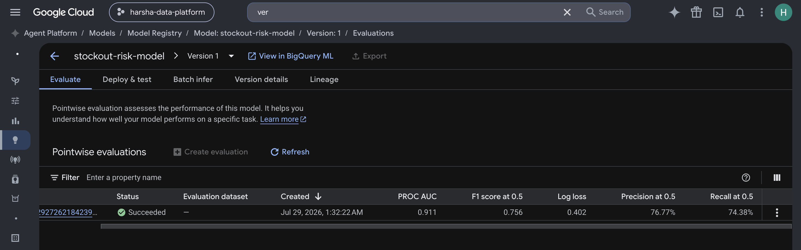
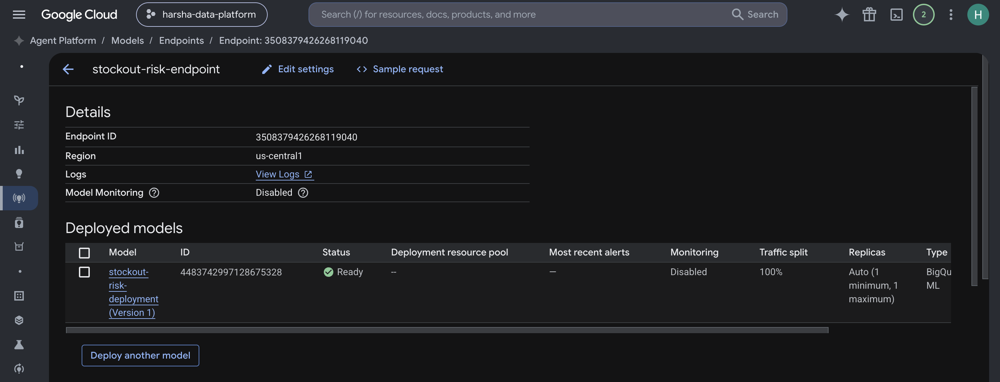
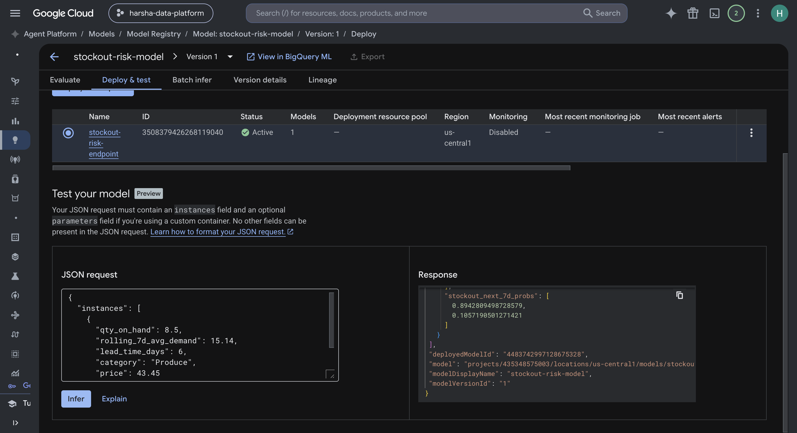
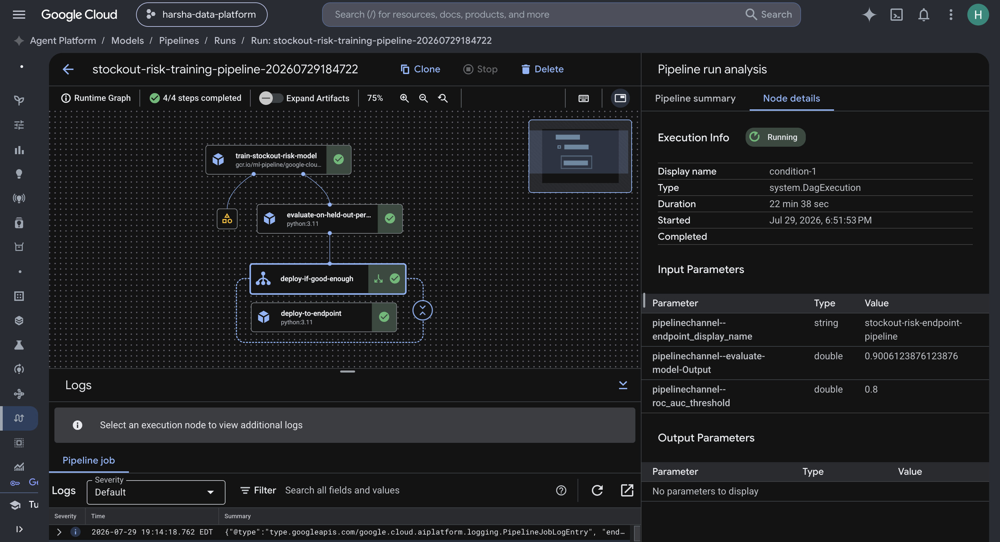
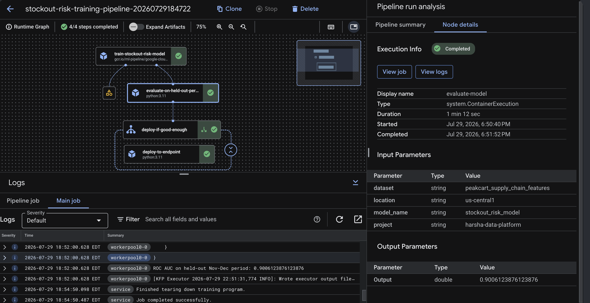
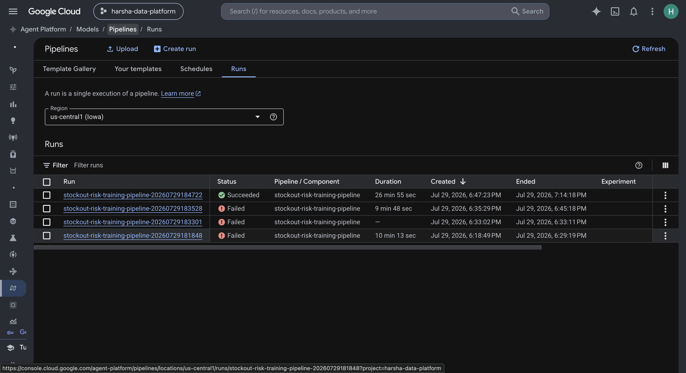
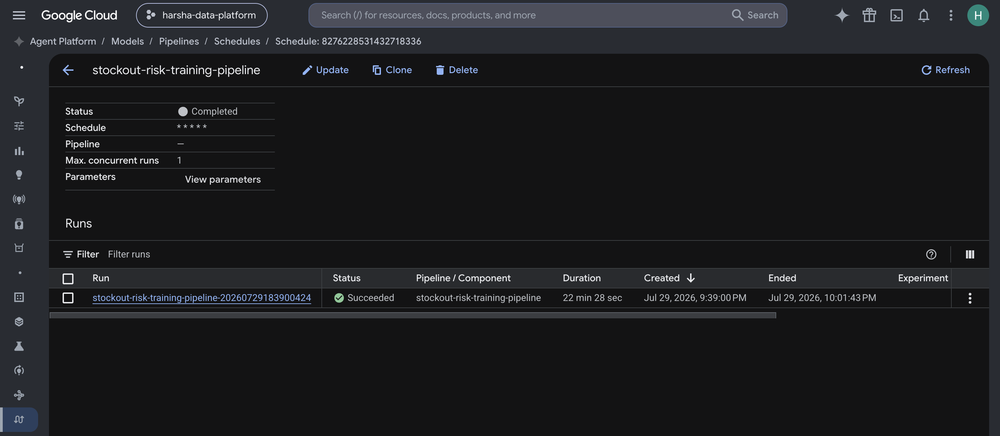
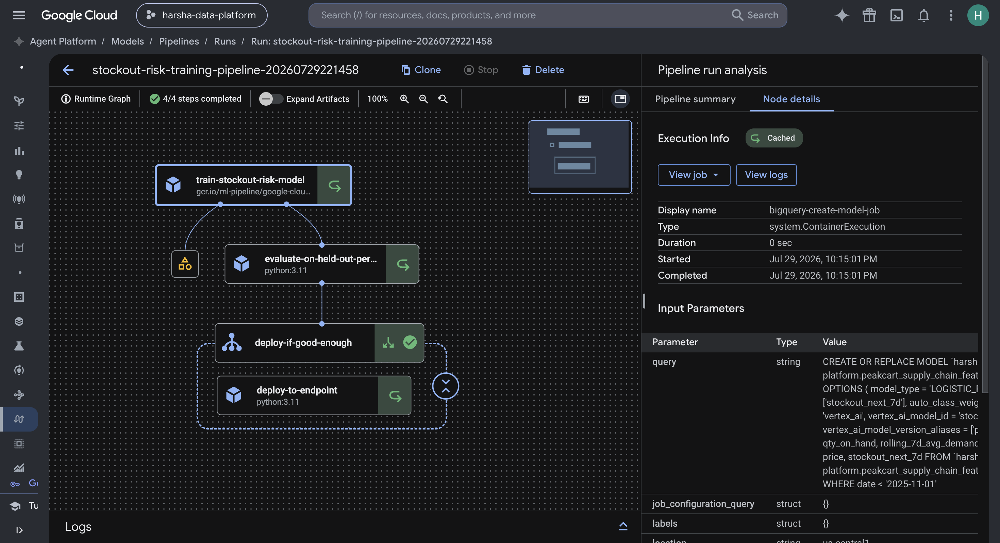
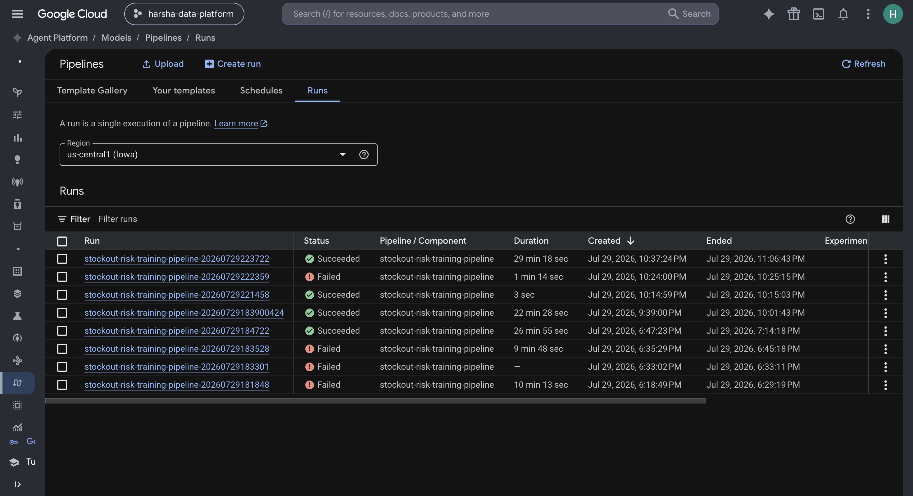

# Project 5: Supply Chain ML Integration

## Overview

A stockout-risk classifier built to learn how AI/ML is actually deployed
on GCP end-to-end: synthetic data with genuine causal signal, feature
engineering in Dataform, model training/evaluation in BigQuery ML, online
serving via the Vertex AI Model Registry and Endpoints, and finally an
automated Vertex AI Pipeline that trains, evaluates, and conditionally
deploys the model as one job. Built with Dataform, BigQuery ML, and
Vertex AI (Model Registry, Endpoints, and Pipelines).

## Architecture

```
generate_project05_data.py (demand + inventory simulation, real signal)
  |
  v
BigQuery bronze (peakcart_supply_chain_bronze) -- raw CSVs, loaded via bq load
  |
  v
Dataform (definitions/stockout_risk_features.sqlx)
  -- joins in project-01's existing bronze_products for category/price
  -- leakage-free label: predicts stockout 7 days out, using only
     same-day-or-earlier features
  |
  v
peakcart_supply_chain_features.stockout_risk_features
  |
  v
BigQuery ML (definitions/train_stockout_risk_model.sqlx, a Dataform
  operations action) -- LOGISTIC_REG, time-based train/test split
  |
  |---> ML.EVALUATE / ML.WEIGHTS (in BigQuery)
  |
  v
Vertex AI Model Registry (auto-registered via model_registry='vertex_ai')
  |
  v
Vertex AI Endpoint -- online predictions (verified, then torn down)


-- Phase 4: the same train -> evaluate -> deploy sequence, automated --

pipelines/stockout_risk_pipeline.py (KFP v2, submitted as a Vertex AI PipelineJob)
  |
  v
train-stockout-risk-model (BigqueryCreateModelJobOp)
  |
  v
evaluate-on-held-out-period (custom component, ML.EVALUATE via BigQuery client)
  |
  v
deploy-if-good-enough (dsl.If roc_auc >= threshold)
  |
  v
deploy-to-endpoint (custom component, Vertex AI REST API, disableExplanations=true)


-- Scheduling: the same pipeline, safe to run repeatedly --

undeploy-existing-model (frees the model resource so it can be retrained)
  |
  v
train-stockout-risk-model  (caching explicitly disabled on every task below)
  |
  v
evaluate-on-held-out-period
  |
  v
deploy-if-good-enough -> deploy-to-endpoint (reuses one endpoint, swaps traffic, undeploys the old version)
  |
  v
Vertex AI PipelineJobSchedule (bounded: max_run_count=1, verified via started_run_count, then permanently COMPLETED)
```

## Key Technical Decisions

### Why a separate data generator with injected signal

The other generators in this repo (`generate_peakcart_data.py`,
`generate_project03_data.py`) deliberately use uniformly random fields --
they exist to test pipeline robustness, not to support ML. Training a
model on that would just fit noise. `generate_project05_data.py`
simulates a full year of daily demand and inventory per product with
genuine causal structure instead: demand has weekend seasonality and
price elasticity, stock depletes against that demand and reorders after
the product's real supplier lead time, and stockouts are a real emergent
outcome of the simulation, not an independently-random label. Verified
concretely before building anything downstream: stockout rate rises
monotonically with lead time (3.87% short / 9.36% medium / 14.96% long).
It's a separate script (not a change to the shared generators) since
projects 1 and 3 depend on those scripts' exact row counts and seed
behavior.

### Leakage-free forward-looking label

`stockout_risk_features` predicts `stockout_next_7d` using a window frame
that looks strictly **forward** (`ROWS BETWEEN 1 FOLLOWING AND 7
FOLLOWING`), never the same day's own outcome. Using today's own
stockout flag as a feature (or letting it leak into the label window)
would make the "prediction" trivial. Rows within 7 days of each product's
last date are dropped, since their forward window would be truncated
rather than a genuine 7-day horizon.

### Time-based train/test split, not random

The model trains on January-October and is evaluated only on
November-December, data it never saw during training. Rows for the same
product on nearby days are highly similar (slowly-changing stock level,
same lead time), so a random split would let near-duplicate rows leak
between train and test and overstate accuracy. A time split mirrors how
this model would actually be judged in deployment: can it generalize to
a future period, not just interpolate within a period it partially
trained on.

### BQML registers directly to Vertex AI, no manual export

`CREATE MODEL` includes `model_registry = 'vertex_ai'`, so every training
run automatically registers/updates the model in the Vertex AI Model
Registry -- the standard integration path, avoiding a separate
export/upload step.

### Deploying required disabling auto-generated explanations

BQML models registered to Vertex AI automatically get a Shapley-value
explanation spec attached. The first deployment attempt failed after
~13 minutes with a TensorFlow graph-version mismatch inside Vertex's
explanation-serving path -- not a problem with the model or endpoint
config. `gcloud ai endpoints deploy-model` has no flag to disable this;
it required a direct Vertex AI REST API call with
`"deployedModel": {"disableExplanations": true, ...}`. Full story in
`NOTES.md`.

### Cost discipline: create, verify, tear down

Following the same pattern established for Dataflow/Composer in
project-04: the Vertex AI endpoint was created, verified with real online
predictions (three independent ways -- `ML.PREDICT`, a direct REST call,
and the console's own "Deploy & test" UI, all agreeing), then undeployed
and deleted. The Model Registry entry itself is kept (low/no-cost
metadata, same as leaving a BQML model in place).

### Custom pipeline components instead of the built-in ones, where it mattered

The Vertex AI Pipeline (`pipelines/stockout_risk_pipeline.py`) uses Google's
own `BigqueryCreateModelJobOp` for training -- no reason to reinvent a
mature, well-tested component. But evaluation and deployment are custom
Python components instead of the library's built-in `BigqueryEvaluateModelJobOp`
and `ModelDeployOp`: the former's `evaluation_metrics` output is an opaque
`system.Artifact` not worth reverse-engineering, and the latter has no
input to disable the auto-attached explanation spec, so it would hit the
exact same TensorFlow graph-version failure as the manual Phase 3
deployment. Custom components keep the ROC AUC a transparent value the
`dsl.If` condition can compare against, and reuse the proven
`disableExplanations=true` fix directly.

### The hidden tenant-project service account

Getting the pipeline to actually run needed two separate IAM fixes, not
one. First, the pipeline's own service account needs `bigquery.jobUser`/
`bigquery.dataEditor` -- unsurprising. Second, and not documented anywhere
obvious: `BigqueryCreateModelJobOp` doesn't run the BigQuery job as that
service account at all. It runs as a separate, Vertex-AI-managed
**tenant-project service account** (`training-<id>@<tenant>-tp.iam.gserviceaccount.com`)
minted internally for the component's underlying CustomJob launcher. This
only became visible by tracing the actual failing principal in
`cloudaudit.googleapis.com/data_access` logs -- the same log-tracing
technique used to diagnose the Composer worker-churn issue in project-04
and the Dataflow explanation-preprocessing failure in this project's
Phase 3. Full troubleshooting log, including a separate IAM-propagation-delay
red herring in between, is in `NOTES.md`.

### Scheduling surfaced two bugs a one-off run can't catch

A `PipelineJobSchedule` was created bounded (`max_run_count=1`, a
one-minute cron so it fires almost immediately, verified via
`started_run_count` and its permanent `COMPLETED` state afterward --
never left running unattended). Both problems below only appear on a
*second* run against the same parameters, which is exactly what a
schedule does and a single manual demo run never exercises:

1. **Silent full-pipeline caching.** Vertex AI Pipelines caches a task's
   execution whenever its inputs match a prior run, *regardless of side
   effects*. With fixed default parameters (the normal shape of a
   schedule), every run's inputs are identical to the first, so nothing
   ever actually re-executes -- confirmed live via a deploy step that
   returned the exact same endpoint reference as the prior run, and an
   endpoint that was completely unchanged. Fixed with
   `task.set_caching_options(False)` on the train, evaluate, and deploy
   tasks.
2. **BQML refuses to retrain a deployed model.** With caching fixed, the
   very next run failed outright: `FAILED_PRECONDITION: The Model is
   deployed or being deployed at the following Endpoint(s)... Please
   undeploy the model before retry.` Added a new first pipeline step,
   `undeploy_existing_model`, that undeploys whatever is currently
   serving before training starts. This means a real serving gap during
   every retrain cycle -- a deliberate, documented trade-off, not hidden;
   a zero-downtime blue-green swap (a new model version under a separate
   alias, promoted only after it's confirmed healthy) is the real
   production-grade fix, but more complexity than this project needs to
   demonstrate the core gate.

Verified clean end-to-end with both fixes: undeployed the old model,
genuinely retrained (model version 3, not a reused version 2), evaluated
for real, deployed to the *same* reused endpoint (no duplicate
endpoints), swapped traffic, served a correct live prediction. Endpoint
undeployed and deleted afterward.

### Model Monitoring: verified three of four pieces live, documented the fourth as a platform-side gap

Created a `ModelDeploymentMonitoringJob` with training-serving skew
detection on all 5 features, 100% request sampling, and the 1-hour
minimum `monitorInterval`. Verified live, with independent evidence
rather than trusting job state alone: the training-side baseline
computed correctly (GCS stats populated per feature), and sending
deliberately skewed traffic directly to the endpoint (`qty_on_hand`,
`rolling_7d_avg_demand`, and `price` all far outside training ranges)
was confirmed actually landing in BigQuery's `serving_predict` table
(this also caught a false alarm: the first round of skewed traffic
never reached the endpoint at all, distinguishable from the real issue
below only by resending it and watching the row count move).

What didn't work: the periodic serving-side skew analysis never fired,
even after 1.5+ hours against a 1-hour interval. The job's own
`nextScheduleTime`/`updateTime` were frozen at identical values across
every check, `scheduleState` showed `OFFLINE` while `state` showed
`RUNNING`, and no `serving/` GCS stats directory, anomaly log entry, or
Dataflow job ever appeared beyond the initial training-baseline
computation. Rather than leave a billing endpoint running indefinitely
chasing a scheduler that showed no sign of advancing, stopped once
config correctness, training baseline, and live serving-log ingestion
were each independently confirmed, and documented the periodic-analysis
stall as an unresolved platform-side limitation (see `NOTES.md`,
2026-07-30) -- the same honest treatment given to the DirectRunner
`avg_pick_time` limitation in project-04, rather than glossing over it.
Endpoint undeployed, monitoring job paused then deleted (a
`ModelDeploymentMonitoringJob` can't be deleted while `RUNNING`), and
endpoint deleted -- confirmed via a follow-up `GET` that nothing remains.

## Verification Results

| Check | Result |
| --- | --- |
| Signal validation | Stockout rate rises monotonically with lead time: 3.87% -> 9.36% -> 14.96% |
| `ML.EVALUATE` (held out Nov-Dec, never trained on) | ROC AUC 0.90, accuracy 83%, F1 0.75 |
| Vertex AI auto-evaluation (independent) | ROC AUC 0.911, F1 0.756 -- corroborates the BQML numbers |
| `ML.WEIGHTS` | `lead_time_days` (0.120) and `rolling_7d_avg_demand` (0.109) are the strongest positive drivers -- matches the simulation's design, not an accident |
| Live online prediction | 89.4% stockout-risk probability for a low-stock/high-lead-time example, identical across `ML.PREDICT`, a direct REST call, and the console UI |
| Cost discipline | Vertex AI endpoint created, verified, then undeployed and deleted -- nothing left running/billing |
| Vertex AI Pipeline (Phase 4) | Full run succeeded: trained a fresh model version, evaluated it at ROC AUC 0.9006 (confirmed via the task's actual output value, not just its state), took the conditional deploy branch for real, served a correct live prediction from the pipeline-deployed endpoint, then torn down |
| Scheduling | Bounded schedule (`max_run_count=1`) fired exactly once then permanently completed; surfaced and fixed two real bugs (silent caching, retrain-while-deployed conflict); final corrected run genuinely retrained to model version 3, reused the same endpoint (no duplicates), and served a correct prediction |
| Model Monitoring | Config, training baseline, and live serving-log ingestion all independently verified; periodic serving-side skew analysis never fired after 1.5+ hrs (documented platform-side limitation, not a config issue); endpoint and monitoring job torn down |

See `NOTES.md` for the full dated build log, including the BigQuery
dataset immutable-rename gotcha and the explanation-preprocessing
deployment failure and its fix.

### Evidence

Model Registry's own evaluation, corroborating the BQML numbers:



The deployed model on the endpoint, status Ready:



A live online prediction made directly through the console's "Deploy & test" UI:



The full pipeline run, all 4 steps green, with the `condition-1` node's actual
input values (0.9006 vs. the 0.8 threshold) that triggered the deploy branch:



The `evaluate-model` step's own logged output, confirming the ROC AUC value:



The full runs list, including the 3 failed attempts from troubleshooting the IAM issues:



The bounded Schedule, permanently `Completed` after its one verified firing:



A run hitting the caching bug -- note the distinct cached-icon nodes and "Execution Info: Cached":



The final corrected run, 5/5 steps (including the new `undeploy-existing-model` step), all genuinely green:


The complete runs history across all scheduling/troubleshooting attempts:



## How to Run

### Prerequisites

- GCP project with BigQuery, Dataform, and Vertex AI (`aiplatform.googleapis.com`) APIs enabled
- Terraform applied (`infrastructure/terraform/`) for the bronze BigQuery dataset
- Node.js/npx available (Dataform CLI is run via `npx @dataform/cli@3`, no global install needed)
- `products.csv`/`suppliers.csv` already generated (`shared/data-generators/generate_peakcart_data.py`)

### Generate data and load bronze

```bash
python3 shared/data-generators/generate_project05_data.py
bq load --autodetect --source_format=CSV --skip_leading_rows=1 \
  harsha-data-platform:peakcart_supply_chain_bronze.product_demand_daily \
  shared/data-generators/output/project-05/product_demand_daily.csv
bq load --autodetect --source_format=CSV --skip_leading_rows=1 \
  harsha-data-platform:peakcart_supply_chain_bronze.inventory_daily \
  shared/data-generators/output/project-05/inventory_daily.csv
```

### Build features and train the model

```bash
cd dataform
npx --yes @dataform/cli@3 init-creds .   # first time only; falls back to ADC
npx --yes @dataform/cli@3 run .
```

### Evaluate and inspect the model

```sql
SELECT * FROM ML.EVALUATE(MODEL `harsha-data-platform.peakcart_supply_chain_features.stockout_risk_model`,
  (SELECT qty_on_hand, rolling_7d_avg_demand, lead_time_days, category, price, stockout_next_7d
   FROM `harsha-data-platform.peakcart_supply_chain_features.stockout_risk_features`
   WHERE date >= '2025-11-01'));

SELECT processed_input, weight
FROM ML.WEIGHTS(MODEL `harsha-data-platform.peakcart_supply_chain_features.stockout_risk_model`)
ORDER BY ABS(weight) DESC;
```

### Deploy to Vertex AI (billable -- verify then tear down)

```bash
gcloud ai endpoints create --region=us-central1 --display-name=stockout-risk-endpoint

# Deploy with explanations disabled (required -- see NOTES.md)
TOKEN=$(gcloud auth print-access-token)
curl -X POST -H "Authorization: Bearer $TOKEN" -H "Content-Type: application/json" \
  -d '{"deployedModel": {"model": "projects/PROJECT_NUMBER/locations/us-central1/models/stockout-risk-model", "dedicatedResources": {"machineSpec": {"machineType": "n1-standard-2"}, "minReplicaCount": 1, "maxReplicaCount": 1}, "disableExplanations": true}}' \
  "https://us-central1-aiplatform.googleapis.com/v1/projects/PROJECT_NUMBER/locations/us-central1/endpoints/ENDPOINT_ID:deployModel"

# Predict, then tear down
curl -X POST -H "Authorization: Bearer $TOKEN" -H "Content-Type: application/json" \
  -d '{"instances": [{"qty_on_hand": 8.5, "rolling_7d_avg_demand": 15.14, "lead_time_days": 6, "category": "Produce", "price": 43.45}]}' \
  "https://us-central1-aiplatform.googleapis.com/v1/projects/PROJECT_NUMBER/locations/us-central1/endpoints/ENDPOINT_ID:predict"

gcloud ai endpoints undeploy-model ENDPOINT_ID --region=us-central1 --deployed-model-id=DEPLOYED_MODEL_ID
gcloud ai endpoints delete ENDPOINT_ID --region=us-central1 --quiet
```

### Run the automated pipeline (Phase 4)

```bash
python3.11 -m venv ~/.venv/vertex-pipelines-env
source ~/.venv/vertex-pipelines-env/bin/activate
pip install -r pipelines/requirements.txt

cd pipelines
python3 stockout_risk_pipeline.py   # compiles to stockout_risk_pipeline.json

python3 - <<'EOF'
from google.cloud import aiplatform

aiplatform.init(project="harsha-data-platform", location="us-central1")
job = aiplatform.PipelineJob(
    display_name="stockout-risk-pipeline-run",
    template_path="stockout_risk_pipeline.json",
    pipeline_root="gs://peakcart-vertex-pipelines-2026/pipeline-root",
    parameter_values={"roc_auc_threshold": 0.8, "endpoint_display_name": "stockout-risk-endpoint-pipeline"},
)
# Must specify a service account with bigquery.jobUser/bigquery.dataEditor --
# AND grant those same roles to the Vertex-AI-managed tenant training SA
# that BigqueryCreateModelJobOp actually runs as (see NOTES.md).
job.submit(service_account="peakcart-vertex-pipelines@harsha-data-platform.iam.gserviceaccount.com")
EOF
```

After a run succeeds and you've verified the deployed endpoint, undeploy
and delete it the same way as the manual deployment above.

### Create a bounded schedule (verify, don't leave it running)

```bash
source ~/.venv/vertex-pipelines-env/bin/activate
cd pipelines
python3 - <<'EOF'
from google.cloud import aiplatform

aiplatform.init(project="harsha-data-platform", location="us-central1")
pipeline_job = aiplatform.PipelineJob(
    display_name="stockout-risk-pipeline-scheduled",
    template_path="stockout_risk_pipeline.json",
    pipeline_root="gs://peakcart-vertex-pipelines-2026/pipeline-root",
    parameter_values={"roc_auc_threshold": 0.8, "endpoint_display_name": "stockout-risk-endpoint-pipeline"},
)
# max_run_count bounds it -- fires this many times then permanently
# transitions to COMPLETED, rather than running indefinitely unattended.
schedule = pipeline_job.create_schedule(
    cron="0 3 * * 1",  # e.g. weekly, Mondays 3am UTC
    display_name="stockout-risk-weekly-retrain",
    max_run_count=4,
    service_account="peakcart-vertex-pipelines@harsha-data-platform.iam.gserviceaccount.com",
)
print(schedule.resource_name)
EOF
```

## Files

```
project-05-supply-chain-ml/
  dataform/
    workflow_settings.yaml               Dataform project config (BigQuery project/location/dataset)
    definitions/
      sources/                           Declarations for bronze tables (own + reused from project-01)
      stockout_risk_features.sqlx        Leakage-free feature table (7-day-forward label)
      train_stockout_risk_model.sqlx     BQML CREATE MODEL, registers to Vertex AI on every run
  pipelines/
    stockout_risk_pipeline.py            KFP v2 pipeline: undeploy -> train -> evaluate -> conditional deploy (caching disabled, safe to schedule/rerun)
    requirements.txt                     kfp / google-cloud-pipeline-components / google-cloud-aiplatform
  infrastructure/
    terraform/                           Bronze BigQuery dataset, Vertex AI API + pipelines bucket/SA
  screenshots/                           Vertex AI + Vertex AI Pipelines verification evidence
  NOTES.md                               Dated build log (the "why", including the gotchas)
```
