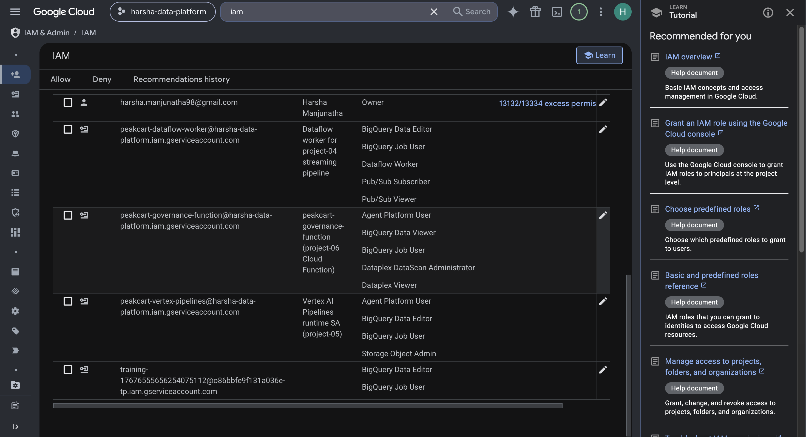
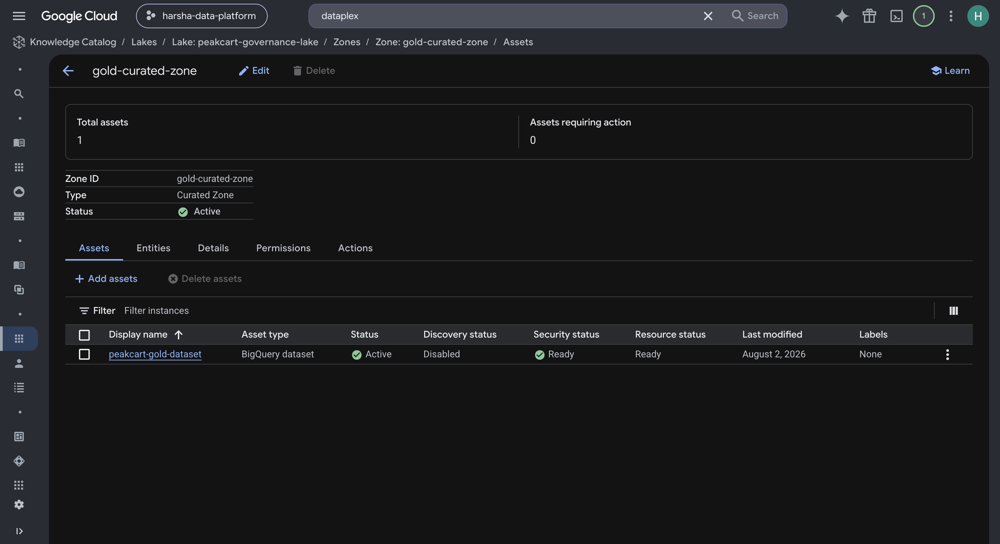
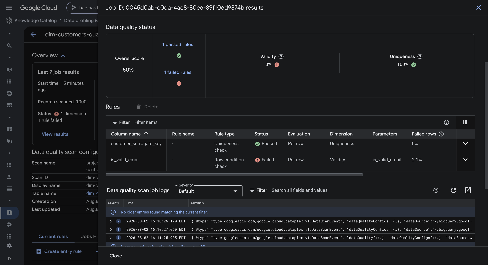
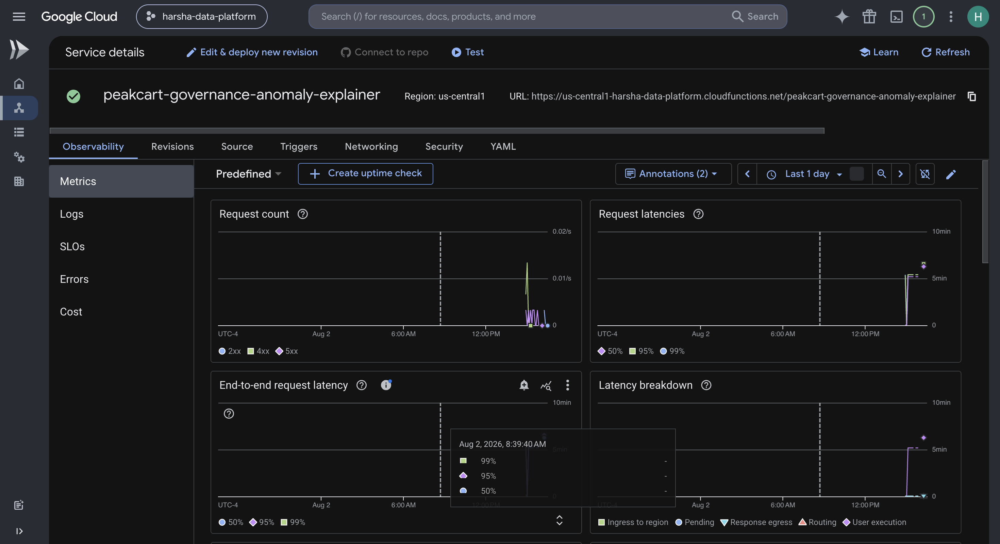
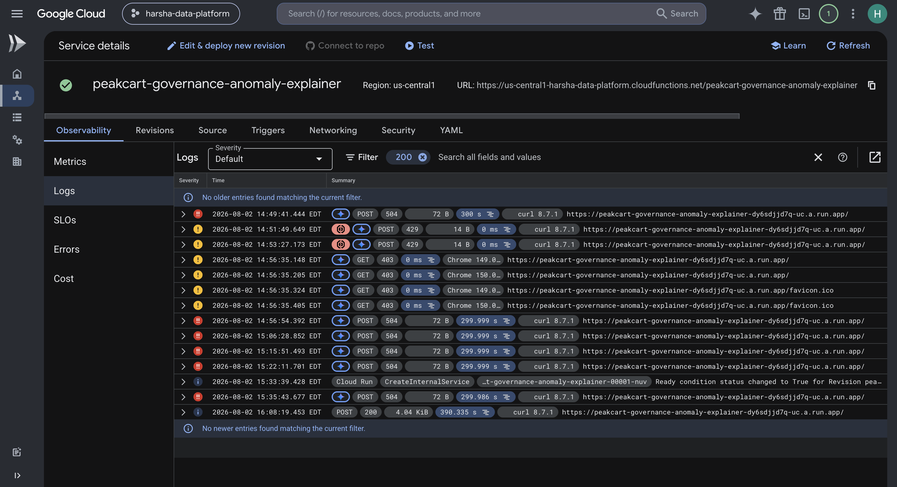
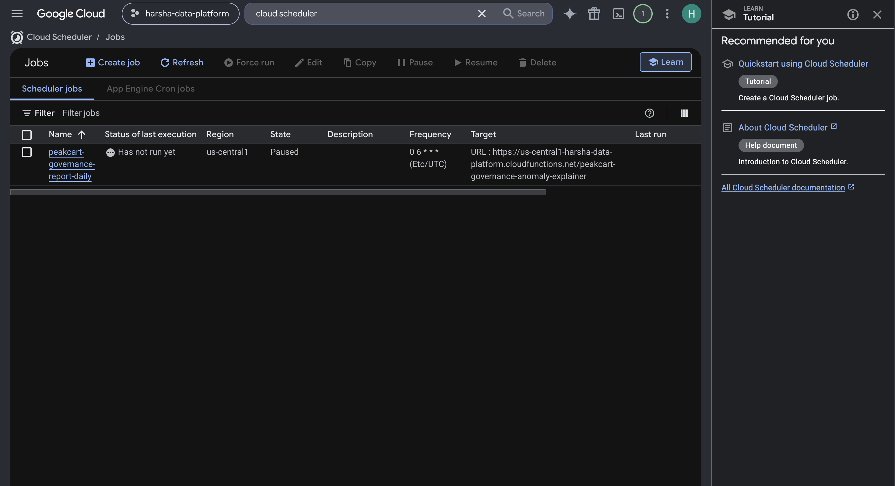
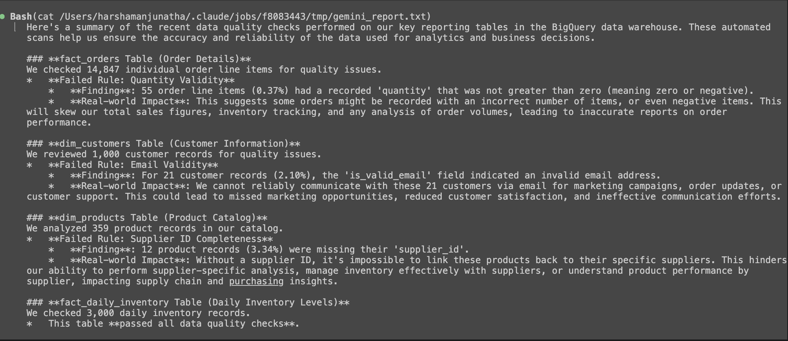

# Project 6: Data Governance + GenAI Workflows

## Overview

Adds a data governance layer over the existing `peakcart_gold` BigQuery
dataset (built in project-01): Dataplex data quality scans check real,
previously-uncaught data issues in the gold layer, and a Cloud Function calls
the Gemini API to turn the raw pass/fail results into a plain-English
governance report — a working example of calling a generative model
programmatically as part of a pipeline, not just using the Gemini features
already built into the BigQuery console.

Nothing here duplicates project-01/03/04/05 infrastructure: the BigQuery
dataset, Dataform/dbt models, and pipeline code are all reused as-is. This
project only adds the governance and GenAI layer on top.

## Architecture

```
peakcart_gold (BigQuery, built in project-01)
  |
  v
Dataplex Lake (peakcart-governance-lake)
  -> Zone (gold-curated-zone, CURATED)
    -> Asset (peakcart-gold-dataset)
      -> 4 DataScans (data quality, on-demand):
           fact-orders-quality
           dim-customers-quality
           dim-products-quality
           fact-daily-inventory-quality
  |
  v
Cloud Function (peakcart-governance-anomaly-explainer)
  1. Runs all 4 DataScans via the Dataplex REST API
  2. Polls each job to completion
  3. Summarizes rule pass/fail + failing row counts
  4. Calls Gemini (gemini-2.5-flash via the google-genai SDK, Vertex AI backend)
  5. Returns scan summaries + a plain-English governance report
  |
  ^
Cloud Scheduler (peakcart-governance-report-daily)
  Bounded, paused by default -- invokes the function on a daily cron
  when enabled, rather than reacting to an event that doesn't exist
  (see "Key Technical Decisions" below)
```

## Key Technical Decisions

### Why not build a custom NL2SQL assistant or auto-documentation tool

The original "GenAI workflows" scoping considered two ideas: a natural-
language-to-SQL assistant, and automatic table/column documentation
generation. Both are already shipped as first-party console features
("Gemini in BigQuery" already does NL2SQL and suggests column descriptions
natively) -- building a custom version of either would just reinvent an
existing button, not demonstrate anything. Repointed the GenAI piece at
something Google's console feature doesn't do: call the Gemini API
*programmatically* from a custom governance workflow, grounded in real
Dataplex data quality scan results.

### The gold layer isn't as clean as it looks -- found by reading the actual dbt SQL

Rather than assume the gold (mart) layer is clean and scan it for form's
sake, read project-01's actual staging/mart SQL first. Found three real,
previously-invisible gaps:

- `stg_order_items.sql` computes `is_positive_quantity` / `is_positive_price`
  / `is_valid_discount` quality flags in staging -- but `fact_orders.sql`
  never carries those flags forward and never filters on them. Negative-
  quantity/invalid-discount rows seeded in the raw data flow silently into
  the gold fact table today, unflagged.
- `stg_products.sql` casts `supplier_id` with no nullness flag and no
  filter -- NULL-supplier rows can sit in `dim_products` unflagged.
- `dim_customers.sql`, by contrast, *does* correctly carry `is_valid_email`
  through as a real gold column -- an existing flag, just never queried or
  monitored by anything.

This makes the project's actual finding "governance scanning catches what
dbt's own staging layer already computed but silently dropped at the mart,"
rather than a scan against data assumed clean.

### Data quality rules (threshold 1.0 -- any real violation shows as FAILED)

| Table | Rule | Dimension |
| --- | --- | --- |
| `fact_orders` | `quantity > 0` | VALIDITY |
| `fact_orders` | `unit_price > 0` | VALIDITY |
| `fact_orders` | `discount BETWEEN 0 AND 1` | VALIDITY |
| `fact_orders` | `customer_surrogate_key IS NOT NULL` | COMPLETENESS |
| `fact_orders` | `product_surrogate_key IS NOT NULL` | COMPLETENESS |
| `dim_customers` | `is_valid_email = true` | VALIDITY |
| `dim_customers` | `customer_surrogate_key` uniqueness | UNIQUENESS |
| `dim_products` | `supplier_id IS NOT NULL` | COMPLETENESS |
| `dim_products` | `product_surrogate_key` uniqueness | UNIQUENESS |
| `fact_daily_inventory` | `qty_available >= 0` | VALIDITY |

### No Eventarc trigger for Dataplex scan completion -- checked before building, not after

Originally planned "Cloud Function fires automatically when a scan
completes" via Eventarc. Checked directly with `gcloud eventarc providers
describe dataplex.googleapis.com` rather than assuming -- Dataplex's only
direct Eventarc events are `dataScan.v1.{created,updated,deleted}` (the
*resource* lifecycle), not job/execution completion. BigQuery has no direct
Eventarc provider at all, only audit-log-based triggers that fire on job
*submission*. Pivoted before writing any function code: a single
self-contained Cloud Function runs the scan, polls it to completion, then
calls Gemini -- invoked by Cloud Scheduler rather than reacting to an event
that doesn't exist.

### Three real bugs, found by working outward from "does this piece even work"

Every clean invocation attempt of the deployed function initially returned a
`504 upstream request timeout` with zero application log lines -- even
after recreating the function completely from scratch. Rather than keep
guessing at the deployed function, built the smallest possible reproduction
at each step using disposable throwaway test functions under the same real
service account:

1. **Wrong/expired model name**: `gemini-2.0-flash-001` returned `404
   NOT_FOUND`. Checked which models actually resolve
   (`gemini-2.5-flash`/`gemini-2.5-pro` do) rather than guessing again, and
   switched off the deprecated `vertexai.generative_models` SDK to the
   current `google-genai` SDK.
2. **Stacked pip dependency conflicts**: `google-auth` exact-pin conflicts
   with `google-cloud-aiplatform`, then again with `google-genai`. Fixed by
   using a floor (`google-auth>=2.56.0`) instead of chasing exact
   cross-package pins.
3. **The real one**: each Dataplex scan was taking ~90-100s end-to-end in
   this environment (vs. ~30s in earlier isolated manual tests -- almost
   certainly BigQuery on-demand slot contention from the volume of scans run
   during this session). Four sequential scans need ~400s, comfortably past
   the original 300s Cloud Function timeout. Isolated this with a stripped
   test function (no Gemini, same service account and dependencies) before
   touching the real function again. Fixed by raising `timeout_seconds` to
   480 and `available_cpu` to `"1"`.

### Cost discipline

Everything created for verification -- the Cloud Function, its IAM invoker
bindings, and the Cloud Scheduler job -- was created, verified live with a
real end-to-end invocation, then torn down. Left in place (no ongoing cost,
fully reproducible from Terraform): the Dataplex lake/zone/asset, all 4
DataScans, the two service accounts, and the function-source GCS bucket --
these are the project's actual Terraform-managed deliverable, the same
pattern used for BigQuery datasets/Dataform models in projects 1 and 5.

## Verification Results

| Check | Result |
| --- | --- |
| Data quality scans (live, on real gold-layer data) | 3 of 4 tables failed at least one rule with real, non-zero counts; 1 table passed cleanly -- a genuine mixed result, not a contrived demo |
| `fact_orders` | FAILED `quantity > 0`: 55 / 14,847 rows (0.37%) |
| `dim_customers` | FAILED `is_valid_email`: 21 / 1,000 rows (2.10%, matches the documented ~2% seeded rate) |
| `dim_products` | FAILED `supplier_id IS NOT NULL`: 12 / 359 rows (3.34%) |
| `fact_daily_inventory` | Passed every rule |
| Cloud Function (live invocation) | Ran all 4 scans, polled to completion, called Gemini, returned a correct, non-fabricated report referencing the real failing counts above |
| Cost discipline | Function, IAM bindings, and Scheduler job created, verified, then torn down; Dataplex resources left in place (no ongoing cost) |

See `NOTES.md` for the full dated build log, including the scoping pivot
away from duplicating built-in Gemini-in-BigQuery features and the full
three-bug debugging story.

### Evidence

IAM: the `peakcart-governance-function` service account and its granted roles
(Dataplex DataScan Administrator, BigQuery Data Viewer/Job User, Vertex AI
User):



The Dataplex lake/zone/asset hierarchy, with `peakcart-gold-dataset`
registered as a governed BigQuery dataset asset:



A real failed data quality rule on `fact_orders` -- `quantity > 0` failing
for 0.37% of rows, caught live:


A real failed data quality rule on `dim_customers` -- `is_valid_email`
failing for 2.1% of rows:



The Cloud Function's observability metrics (request count, latencies) after
live verification:



The Cloud Function's full logs history across the debugging session --
timeouts during diagnosis, then a clean `200` on the successful run:



The Cloud Scheduler job, configured but left `Paused` by default (cost
discipline):



The actual Gemini-generated governance report from a live run, referencing
the real anomalies found above:



## How to Run

### Prerequisites

```bash
cd project-06-governance-ai/infrastructure/terraform
terraform init
terraform plan
terraform apply
```

This creates the Dataplex lake/zone/asset, the 4 DataScans, both service
accounts, and the function-source bucket. The Cloud Function and Cloud
Scheduler job are defined in the same `main.tf` but were torn down after
verification -- re-apply to recreate them.

### Run a data quality scan manually

```bash
curl -X POST \
  -H "Authorization: Bearer $(gcloud auth print-access-token)" \
  "https://dataplex.googleapis.com/v1/projects/harsha-data-platform/locations/us-central1/dataScans/fact-orders-quality:run" \
  -d '{}'
```

Check results in the console under Dataplex -> Govern -> Quality, or via:

```bash
curl -H "Authorization: Bearer $(gcloud auth print-access-token)" \
  "https://dataplex.googleapis.com/v1/projects/harsha-data-platform/locations/us-central1/dataScans/fact-orders-quality/jobs/<job-id>?view=FULL"
```

### Invoke the anomaly-explainer function (after `terraform apply` recreates it)

```bash
FUNCTION_URL=$(gcloud functions describe peakcart-governance-anomaly-explainer \
  --gen2 --region=us-central1 --project=harsha-data-platform \
  --format="value(serviceConfig.uri)")
curl -X POST \
  -H "Authorization: Bearer $(gcloud auth print-identity-token)" \
  "$FUNCTION_URL" --max-time 490
```

Takes several minutes (runs 4 sequential scans, each ~30-100s depending on
BigQuery slot availability, then calls Gemini).

## Files

```
project-06-governance-ai/
  infrastructure/terraform/
    main.tf              # Dataplex lake/zone/asset/DataScans, Cloud Function, Cloud Scheduler, IAM
    variables.tf
    outputs.tf
  functions/anomaly_explainer/
    main.py               # Runs scans, polls to completion, calls Gemini
    requirements.txt
  screenshots/             # Evidence referenced above
  NOTES.md                 # Dated build log
  README.md
```
